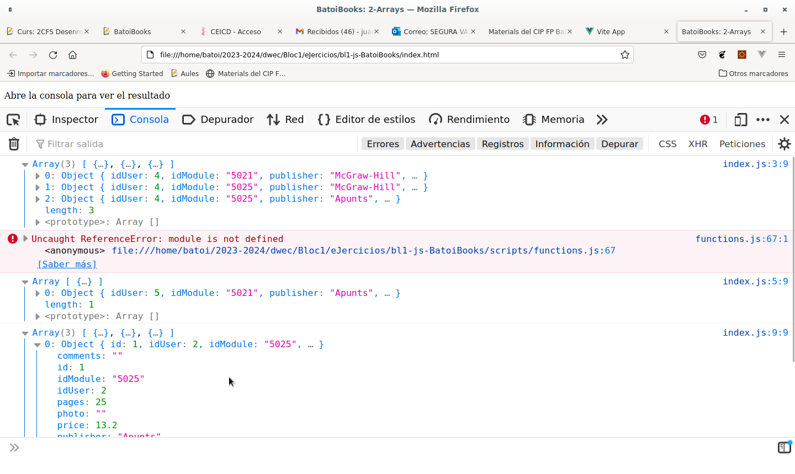

# Bloc 1: Javascript. UT 2: Arrays
## Práctica 2.1 - BatoiBooks
En esta primera parte de la aplicación crearemos las pricipales funciones para trabajar con nuestros datos (recuerda que por ahora los tenemos en el fichero `datos.js` en una variable llamada `data`). En concreto haremos las funciones para trabajar con libros, usuarios y módulos.

Para poder pasar los tests a nuestro programa y comprobar si funciona repartiremos el código en 2 ficheros JS distintos:
- **`main.js`**: es el programa principal que hace llamadas a las funciones y muestra datos por la consola
- **`functions.js`**: es el fichero que contiene las funciones, que son:
  - **booksFromUser(array, number) : array**: recibe el array de libros y la id de un usuario y devuelve el array con todos los libros de dicho usuario
  - **booksFromModule(array, string) : array**: recibe el array de libros y el código de un módulo y devuelve el array con todos los libros de dicho módulo
  - **booksCheeperThan(array, number) : array**: recibe el array de libros y un valor y devuelve el array con todos los libros cuyo precio es inferior o igual al valor pasado
  - **booksWithStatus(array, string) : array**: recibe el array de libros y un estado ("new", "good", ...) y devuelve el array con todos los libros de dicho estado
  - **averagePriceOfBooks(array) : number**: recibe el array de libros y devuelve el precio medio de los mismos, con 2 decimales y en € (ej.: "23.40 €")
  - **booksOfTypeNote(array) : array**: recibe el array de libros y devuelve un array con todos los que son apuntes
  - **booksNotOfTypeNote(array) : array**: como el anterior pero devuelve los que NO son apuntes
  - **booksNotSold(array) : array:** recibe el array de libros y devuelve un array con todos los que NO se han vendido aún
  - **incrementPriceOfbooks(array, number) : undefined**: recibe el array de libros y el porcentaje a incrementar (ej. 0,1 == 10%) e incrementa su precio (no devuelve nada)
  - **getUserById(array, number) : object**: recibe el array de usuarios y una id y devuelve el usuario con dicha id
  - **getUserIndexById(array, number) : object**: igual pero devuelve la posición del usuario dentro del array _users_
  - **getUserByNickName(array, string) : object**: recibe el array de usuarios y un nombre de usuario (_nick_) y devuelve el usuario con dicho _nick_
  - **getModuleByCode(array, string) : object**: recibe el array de módulos y un código y devuelve el módulo con dicho código (campo _code_)
  - **getModuleIndexByCode(array, string) : object**: igual pero devuelve la posición del módulo dentro del array _modules_

Recuerda que para poder acceder a este código al final del fichero debemos añadir la instrucción:

```javascript
export {
  booksFromUser,
  booksFromModule,
  booksCheeperThan,
  booksWithStatus,
  averagePriceOfBooks,
  booksOfTypeNote,
  booksNotOfTypeNote,
  booksNotSold,
  incrementPriceOfbooks,
  getUserById,
  getUserIndexById,
  getUserByNickName,
  getModuleByCode,
  getModuleIndexByCode
}
```

En el `main.js` mostraremos por consola:
- todos los libros del usuario 4
- todos los libros del módulo 5021 que están en buen estado ("good")
- incrementa un 10% el precio de los libros del módulo 5025 y muéstralos

El resultado debe ser algo como:



**IMPORTANTE**: no usaremos **ningún _for_** para recorrer los arrays. Siempre que sea posible usaremos _Functional Programming_. Los nombres de las variables deben ser adecuados y con sentido.

**RECUERDA**: seguir haciendo todas las buenas prácticas que se indicaban en el ejercicio anterior.

**MUY IMPORTANTE**: pasa los tests para asegurarte aprobar este ejercicio.
